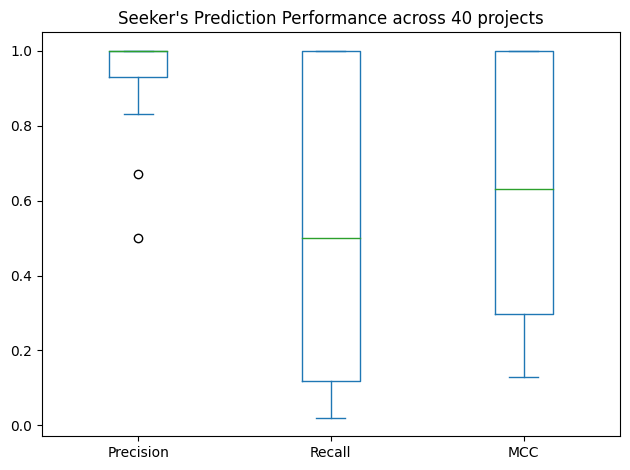

# Enabling Efficient Assertion Inference

This repo contains the source code and data set for the paper _Enabling Efficient Assertion Inference_, **accepted** in the 34th IEEE International Symposium on Software Reliability Engineering (ISSRE 2023).

The accepted paper is available here: 

The PDF version of this paper is available here: 

The bib entry to cite this paper is available here: 

---

The dataset is composed of the following:

1) _Codebase_ gathered for the _46_ _Java_ subjects (_40_ from previous works [1-3] and _6_ _Maven_ projects [4-6]);

2) _Mutants_ for every corresponding _subject_ available in following directories:

    _Mutants_ for subjects used for _Performance_ evaluation are available in specfuzzer-results/_subject_/setup-files/mutants directory,
    
    _Mutants_ for subjects used for _Scalability_ evaluation are available in dataset/scalability_dataset/specfuzzer-results/_subject_/setup-files/mutants;

3) _Mutants selected/labeled_ for every corresponding _subject_ available in following directories:

    _Mutants_ for subjects used for _Performance_ evaluation are available in dataset/summary/[PREDICTED or SUBSUMING or RANDOM]/_subject_/setup-files/mutants,
    
    _Mutants_ for subjects used for _Scalability_ evaluation are available in dataset/scalability_dataset/summary/[PREDICTED or SUBSUMING or RANDOM]/_subject_/setup-files/mutants;
    
    Please note that only the last iteration of 10 iterations performed for Random selection are available as mentioned above.

4) _Evosuite_ and _Randoop_ generated test suite for every corresponding _subject_ available in following directories:

    _Test suite_ for subjects used for _Performance_ evaluation are available in dataset/subjects_with_tests/_subject_/src/test/java directory,
    
    _Test suite_ for subjects used for _Scalability_ evaluation are available in dataset/scalability_dataset/subjects_with_tests/_subject_/src/test/java directory;

5) _Sequence information_ with _subject_name_, _mutant_num_, _seq_ containing _mutation annotation_, and corresponding _label_ is available in dataset/specfuzzer-extracted/dataset_for_filtered_mutants.json for every subject.

---

Tools/dependencies available in dataset/tools directory or otherwise as stated below:

1. Apache Maven ( available here: https://maven.apache.org/download.cgi )
2. src2abs [7,8] ( available in dataset/tools/seq2seq directory )
3. SpecFuzzer [1] ( available in dataset/tools/specfuzzer directory )
5. Major [10] ( available in dataset/tools/major directory )
6. seq2seq [9] ( available in dataset/tools/seq2seq directory )
7. Tkinter (available here: https://docs.python.org/3.8/library/tkinter.html )
8. TensorFlow ( available here: https://www.tensorflow.org/install/pip )
9. PyYAML ( available here: https://pyyaml.org/wiki/LibYAML )
10. Perl (available here: https://www.cpan.org/modules/INSTALL.html )

---

NOTE: Please do not forget to modify below variables in Data.java file to specify your desired repository locations and/or dependencies

static String dirDatasetOrig = "C:/seeker/dataset";

---

Commands to execute:

java -jar seeker-01.jar [task_name]

Below is the help menu for the tasks that can be performed. The task name (mentioned in capital letters) should be passed as argument.

ANALYZEDATA analyzes the SpecFuzzer logs, determines assertion inferring mutants, subsuming mutants, and extracts related information.

PREPAREDATASET prepares the dataset for model training.

RUNEVOSUITE executes Evosuite for all subjects.

RUNRANDOOP executes Randoop for all subjects.

SIMUTATE sets up directories to run simulations in default configuration, i.e., with no mutant selection.

SIMUTATEWITHPREDICTIONS sets up directories to run simulations with only the predicted mutants.

SIMUTATEWITHRANDOM selects random mutants from the entire mutant set and sets up directories to run simulations with the randomly selected mutants.

*Please note that prepared directories have to renamed manually as Random Mutant Selection should be performed 10 times.

SIMUTATEFORGT determines the score for the inferred Ground Truth assertions in default configuration, i.e., with no mutant selection.

SIMUTATEWITHPREDICTIONSFORGT determines the score for the inferred Ground Truth assertions with only the predicted mutants.

SIMUTATEWITHRANDOMFORGT determines the score for the inferred Ground Truth assertions with the randomly selected mutants.

*Please note that for this step to be performed 10 times, directories have to be manually placed to calculate scores accordingly.

PREPARESCALABILITYDATASET prepares the scalability dataset for model training.

*Please note that to run simulations, etc. for scalability dataset, the variable boolScalability in Data.java file should be changed to true (default is false).

---

---

## References

<a id="1">[1]</a>
Facundo Molina, Marcelo d’Amorim, and Nazareno Aguirre. Fuzzing class specifications. In 44th IEEE/ACM 44th International Conference on Software Engineering, ICSE 2022, Pittsburgh, PA, USA, May 25-27, 2022, pages 1008–1020. ACM, 2022.

<a id="2">[2]</a>
Facundo Molina, Pablo Ponzio, Nazareno Aguirre, and Marcelo F. Frias. Evospex: An evolutionary algorithm for learning postconditions. In 43rd IEEE/ACM International Conference on Software Engineering, ICSE 2021, Madrid, Spain, 22-30 May 2021, pages 1223–1235. IEEE, 2021.

<a id="3">[3]</a>
Valerio Terragni, Gunel Jahangirova, Paolo Tonella, and Mauro Pezz`e. Evolutionary improvement of assertion oracles. In Prem Devanbu, Myra B. Cohen, and Thomas Zimmermann, editors, ESEC/FSE ’20: 28th ACM Joint European Software Engineering Conference and Symposium on the Foundations of Software Engineering, Virtual Event, USA, November 8-13, 2020, pages 1178–1189. ACM, 2020.

<a id="4">[4]</a>
autolink-java. https://github.com/robinst/autolink-java.

<a id="5">[5]</a>
Ristretto. https://github.com/leplusorg/ristretto.

<a id="6">[6]</a>
Apache Commons CLI. https://github.com/apache/commons-cli.

<a id="7">[7]</a>
Michele Tufano, Jevgenija Pantiuchina, Cody Watson, Gabriele Bavota, and Denys Poshyvanyk. On learning meaningful code changes via neural machine translation. In Joanne M. Atlee, Tevfik Bultan, and Jon Whittle, editors, Proceedings of the 41st International Conference on Software Engineering, ICSE 2019, Montreal, QC, Canada, May 25-31, 2019, pages 25–36. IEEE / ACM, 2019.

<a id="8">[8]</a>
Michele Tufano, Cody Watson, Gabriele Bavota, Massimiliano Di Penta, Martin White, and Denys Poshyvanyk. An empirical study on learning bug-fixing patches in the wild via neural machine translation. ACM Trans. Softw. Eng. Methodol., 28(4):19:1–19:29, 2019.

<a id="9">[9]</a>
Mart ́ın Abadi, Ashish Agarwal, Paul Barham, Eugene Brevdo, Zhifeng Chen, Craig Citro, Gregory S. Corrado, Andy Davis, Jeffrey Dean, Matthieu Devin, Sanjay Ghemawat, Ian J. Goodfellow, Andrew Harp, Geoffrey Irving, Michael Isard, Yangqing Jia, Rafal J ́ozefowicz, Lukasz Kaiser, Manjunath Kudlur, Josh Levenberg, Dan Man ́e, Rajat Monga, Sherry Moore, Derek Gordon Murray, Chris Olah, Mike Schuster, Jonathon Shlens, Benoit Steiner, Ilya Sutskever, Kunal Talwar, Paul A. Tucker, Vincent Vanhoucke, Vijay Vasudevan, Fernanda B. Vi ́egas, Oriol Vinyals, Pete Warden, Martin Wattenberg, Martin Wicke, Yuan Yu, and Xiaoqiang Zheng. Tensorflow: Large-scale machine learning on heterogeneous distributed systems. CoRR, abs/1603.04467, 2016.

<a id="10">[10]</a>
Ren ́e Just, Franz Schweiggert, and Gregory M. Kapfhammer. MAJOR: an efficient and extensible tool for mutation analysis in a java compiler. In Perry Alexander, Corina S. Pasareanu, and John G. Hosking, editors, 26th IEEE/ACM International Conference on Automated Software Engineering (ASE 2011), Lawrence, KS, USA, November 6-10, 2011, pages 612–615. IEEE Computer Society, 2011.
